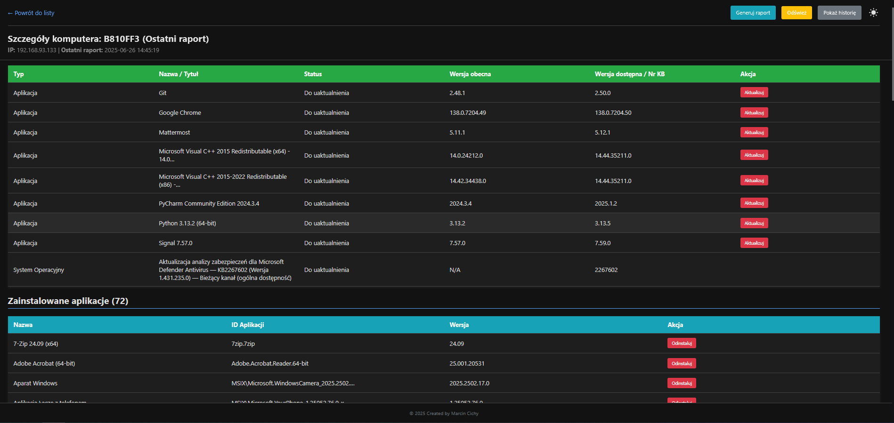

# Winget Central Management Dashboard



---
### (Wersja Polska)

Aplikacja webowa w Pythonie do centralnego zarządzania menedżerem pakietów `winget` na wielu komputerach w sieci lokalnej. Panel umożliwia monitorowanie zainstalowanych aplikacji, dostępnych aktualizacji oraz zdalne wykonywanie akcji, takich jak aktualizacja czy deinstalacja oprogramowania.

#### Główne Funkcjonalności

* **Centralny Panel (Dashboard):** Przejrzysty widok wszystkich monitorowanych komputerów, ich statusu i ostatnich raportów.
* **Monitorowanie Aplikacji:** Szczegółowe listy zainstalowanego oprogramowania i dostępnych aktualizacji dla każdego komputera.
* **Zdalne Akcje:** Możliwość zdalnego zlecania zadań:
    * Aktualizacji pojedynczych aplikacji.
    * Deinstalacji aplikacji.
    * Natychmiastowego odświeżenia raportu.
* **Historia i Audyt:** System przechowuje pełną historię stanu każdego komputera ("migawki"), umożliwiając przeglądanie danych z przeszłości.
* **Dziennik Zdarzeń:** Automatyczne logowanie kluczowych akcji, takich jak sukcesy i porażki zdalnych operacji oraz wykryte aktualizacje systemu Windows.
* **Generowanie Raportów:** Proste generowanie raportów tekstowych dla pojedynczych maszyn oraz raportu zbiorczego.
* **Nowoczesny Interfejs:**
    * Przełącznik motywu Ciemny / Jasny z zapamiętywaniem wyboru.
    * "Lepki" nagłówek i stopka dla łatwiejszej nawigacji.
    * W pełni responsywny układ.

#### Architektura Systemu

System oparty jest na architekturze Klient-Serwer:

1.  **Serwer (Flask):** Aplikacja webowa napisana w Pythonie przy użyciu frameworka Flask. Odpowiada za:
    * Udostępnianie interfejsu użytkownika (panelu webowego).
    * Odbieranie raportów od agentów.
    * Zarządzanie bazą danych (SQLite).
    * Obsługę API do komunikacji z agentami (zlecanie zadań, odbieranie wyników).

2.  **Agent (Python):** Lekki skrypt w Pythonie, który:
    * Działa jako usługa systemowa na komputerach klienckich (po skompilowaniu do `.exe`).
    * Cyklicznie skanuje system za pomocą `winget` i poleceń systemowych.
    * Wysyła pełne raporty o stanie komputera do serwera.
    * Odpytuje serwer o nowe zadania do wykonania (aktualizacja, deinstalacja, etc.).

#### Stos Technologiczny

* **Backend:** Python 3, Flask
* **Frontend:** HTML5, CSS3 (Flexbox, Zmienne CSS), JavaScript
* **Baza Danych:** SQLite
* **Agent:** Python, `subprocess` do wywoływania `winget`
* **Wdrożenie Agenta:** PyInstaller (do tworzenia `.exe`), NSSM (do tworzenia usługi Windows)

#### Instalacja i Uruchomienie

##### 1. Konfiguracja Serwera

1.  Sklonuj lub pobierz repozytorium.
2.  Stwórz i aktywuj wirtualne środowisko Pythona:
    ```bash
    python -m venv venv
    venv\Scripts\activate
    ```
3.  Zainstaluj wymagane biblioteki:
    ```bash
    pip install Flask
    ```
4.  W pliku `app.py` ustaw swój unikalny `API_KEY`.
5.  Zainicjuj bazę danych (ten krok wykonaj tylko raz):
    ```bash
    flask init-db
    ```
6.  Uruchom serwer deweloperski:
    ```bash
    flask run --host=0.0.0.0
    ```

##### 2. Konfiguracja i Wdrożenie Agenta

1.  W pliku `agent.py` ustaw adres IP serwera w `API_ENDPOINT` oraz ten sam `API_KEY`, który ustawiłeś na serwerze.
2.  **Skompiluj agenta do pliku `.exe`** za pomocą PyInstaller (upewnij się, że masz go zainstalowanego: `pip install pyinstaller`):
    ```bash
    pyinstaller --onefile --windowed agent.py
    ```
3.  Gotowy plik `agent.exe` znajdziesz w nowo utworzonym folderze `dist`.
4.  **Wdróż agenta na komputerze klienckim:**
    * Skopiuj `agent.exe` na docelową maszynę (np. do `C:\WingetAgent\`).
    * Zainstaluj go jako usługę systemową za pomocą [NSSM](https://nssm.cc/download), wskazując ścieżkę do pliku `agent.exe`. Upewnij się, że usługa działa z uprawnieniami pozwalającymi na instalację oprogramowania.

#### Możliwe Kierunki Rozwoju

Projekt ma solidne fundamenty i może być dalej rozwijany. Potencjalne nowe funkcje:
* Zaawansowane wyszukiwanie i filtrowanie w historii raportów (np. po dacie).
* System powiadomień (e-mail, Teams) o krytycznych zdarzeniach.
* Panel ze statystykami i wykresami.
* Grupowanie komputerów w panelu (np. wg działów).

---
*&copy; 2025 Created by Marcin Cichy*

---
<br>

### (English Version)

A Python-based web application for centrally managing the `winget` package manager on multiple computers in a local network. The dashboard allows for monitoring installed applications, available updates, and remotely executing actions such as updating or uninstalling software.

#### Key Features

* **Central Dashboard:** A clear view of all monitored computers, their status, and recent reports.
* **Application Monitoring:** Detailed lists of installed software and available updates for each computer.
* **Remote Actions:** Ability to remotely trigger tasks:
    * Updating individual applications.
    * Uninstalling applications.
    * Forcing an immediate report refresh.
* **History & Auditing:** The system stores a complete history of each computer's state ("snapshots"), allowing for the review of past data.
* **Action Log:** Automatic logging of key events, such as the success or failure of remote operations and detected Windows updates.
* **Report Generation:** Simple generation of text reports for individual machines and a consolidated report.
* **Modern UI:**
    * Dark/Light theme toggle with persistence in `localStorage`.
    * Sticky header and footer for easier navigation.
    * Fully responsive layout.

#### System Architecture

The system is based on a Client-Server architecture:

1.  **Server (Flask):** A web application written in Python using the Flask framework. It is responsible for:
    * Serving the user interface (web dashboard).
    * Receiving reports from agents.
    * Managing the database (SQLite).
    * Handling the API for communication with agents (dispatching tasks, receiving results).

2.  **Agent (Python):** A lightweight Python script that:
    * Runs as a system service on client computers (after being compiled to `.exe`).
    * Periodically scans the system using `winget` and system commands.
    * Sends full reports about the computer's state to the server.
    * Polls the server for new tasks to execute (update, uninstall, etc.).

#### Technology Stack

* **Backend:** Python 3, Flask
* **Frontend:** HTML5, CSS3 (Flexbox, CSS Variables), JavaScript
* **Database:** SQLite
* **Agent:** Python, `subprocess` for calling `winget`
* **Agent Deployment:** PyInstaller (for creating `.exe`), NSSM (for creating a Windows service)

#### Setup and Installation

##### 1. Server Configuration

1.  Clone or download the repository.
2.  Create and activate a Python virtual environment:
    ```bash
    python -m venv venv
    venv\Scripts\activate
    ```
3.  Install the required libraries:
    ```bash
    pip install Flask
    ```
4.  In the `app.py` file, set your unique `API_KEY`.
5.  Initialize the database (this step is done only once):
    ```bash
    flask init-db
    ```
6.  Run the development server:
    ```bash
    flask run --host=0.0.0.0
    ```

##### 2. Agent Configuration and Deployment

1.  In the `agent.py` file, set the server's IP address in `API_ENDPOINT` and the same `API_KEY` that you set on the server.
2.  **Compile the agent to an `.exe` file** using PyInstaller (make sure you have it installed: `pip install pyinstaller`):
    ```bash
    pyinstaller --onefile --windowed agent.py
    ```
3.  The finished `agent.exe` file can be found in the newly created `dist` folder.
4.  **Deploy the agent on a client computer:**
    * Copy `agent.exe` to the target machine (e.g., to `C:\WingetAgent\`).
    * Install it as a system service using [NSSM](https://nssm.cc/download), pointing it to the path of the `agent.exe` file. Ensure the service runs with permissions that allow software installation.

#### Future Development

The project has a solid foundation and can be further developed. Potential new features:
* Advanced search and filtering in report history (e.g., by date).
* Notification system (email, Teams) for critical events.
* A dashboard with statistics and charts.
* Grouping computers in the panel (e.g., by department).

---
*&copy; 2025 Created by Marcin Cichy*